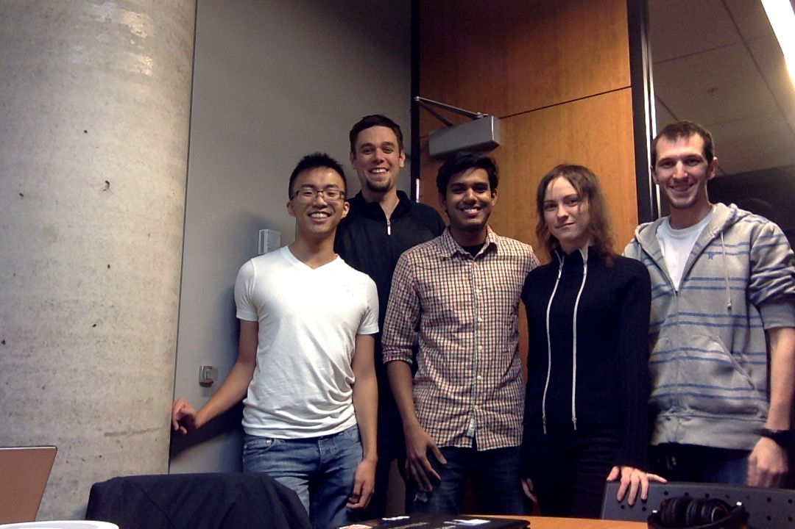

## The Team

---
__Leo Wong__
<!--- fill this in -->

---
__Will Armstrong__
<!--- fill this in -->

---
__Yasith Vidanaarachchi__
<!--- fill this in -->

---
__Yuliya Cherenkova__
<!--- fill this in -->

---
__Chris Primerano__
<!--- fill this in -->

---

## The Project

###Messaging Application for Universities

After carefully considering the suggested project options our group chose to build a messaging application as our product. The decision was unanimous and was reached quickly, as all team members share the same motivation and consider this option as the most interesting and necessary.

The motivation for us to choose this option is that we would like to provide convenient ways for our users to receive news from the topics that interest them. Another, equivalently important reason, is that we would like to improve communication between students and instructors.

Today there exist many applications that provide similar functionality. However, while our university is using some external products to fill this niche, one point to note here is that some students are unhappy as they have to provide their personal information to a third party. We would like to create an application that would belong to our university and will be hosted on its servers to solve this problem.

## Personas

[Katriona Lalange](Personas/Katriona Lalange.md)

[Tiburtius Camilo](Personas/Tiburtius Camilo.md)

## User Stories

[Example](User Stories/example.md)

## MVP

Our product UDeltio is a bulletin board for University communities. Deltio stands for Bulletin in Greek.

UDeltio allows members of the community to start and join bulletin boards. Allowing them to post notices and get notifications for bulletin boards they’re a member of.

For private sub-communities inside the University, you can have private boards. Where only the members can see the posted notices.

UDeltio will have mobile apps, allowing users to access the bulletin board from any where they want to. They will also receive push notifications for boards they have subscribed to.

## Release & Iteration Planning

### User stories to be implemented in first release

| User Stories |
|------------------------------------------------------------------------|
| I want to create a new board for rock-climbing to find new friends     |
| I want to create a new board for a class I will be teaching            |
| I want to post texts and links in the Meditation board I am subscribed to so that I can tell group members about upcoming sessions                 |
| I want to participate in the class discussion board without sharing my private information with a third-party so that i can participate in the class discussions without feeling like my privacy has been violated            |
| I want to view messages in a specific board so that it’s easy to find the messages I want to view                                                  |
| I want to be able to subscribe to a board to get notifications of any new messages                                                                 |

### 3 user-stories excluded from first release:
* I want to be able to group my classes and my extra-curriculars into separate sections on the message board so that I can keep my school work and recreational activities separate
 * This is a nice feature, but it is not required for a core functionality
* I want to get push notification for new messages from subscribed boards
 * None of the team members are familiar with the details of implementation of this feature. It is not required for the core functionality, so it could be postponed to a moment once we actually have a working prototype and can work on features.
* I want to be able to flag inappropriate posts so that I’m not subjected to offensive messages
 * This feature is not important for the core functionality of the application. 

### User stories to implement in the first iteration
The team is not planning to implement any user stories over the first iteration. Instead, the team will focus on setting up the back-end, create API, and getting familiarized with front-end components we plan on using.

## CRC Cards

[Example](CRC Cards/example.md)