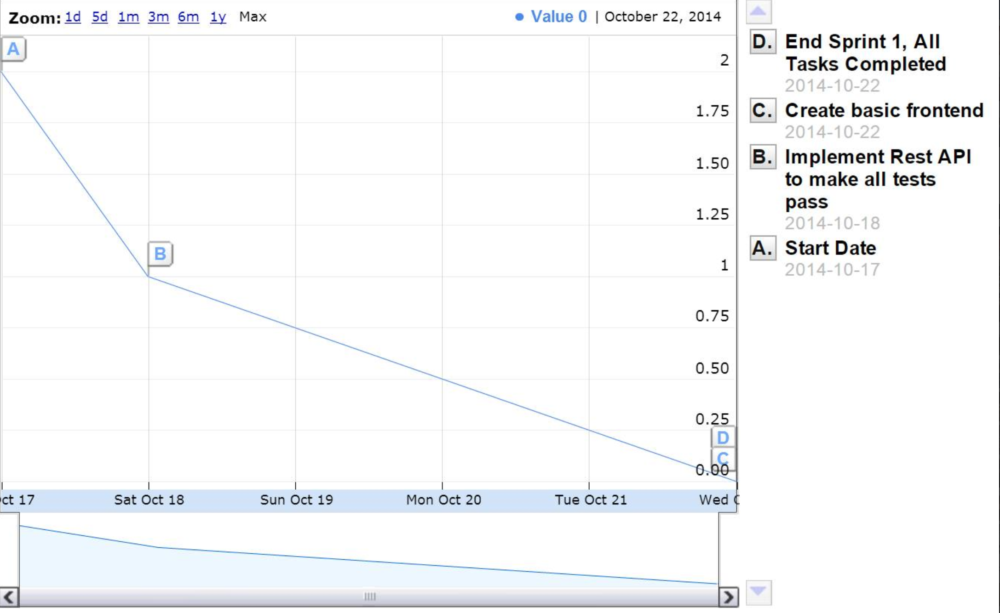
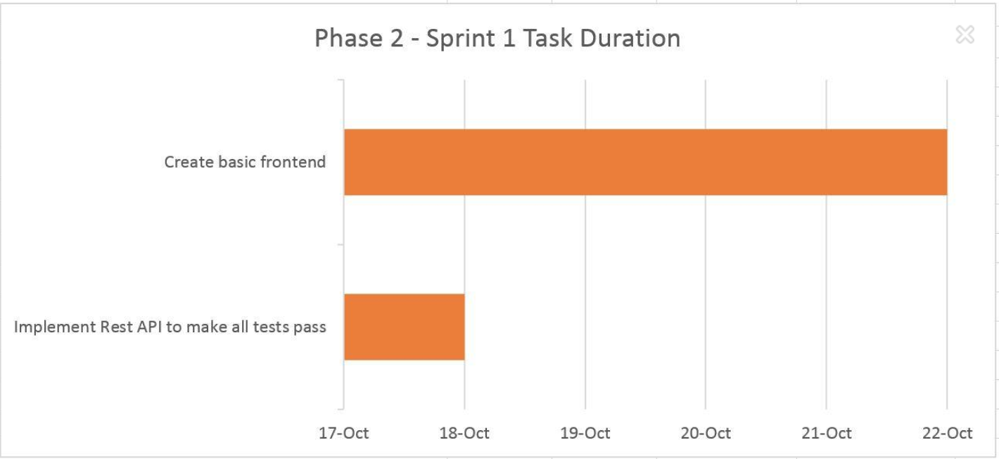
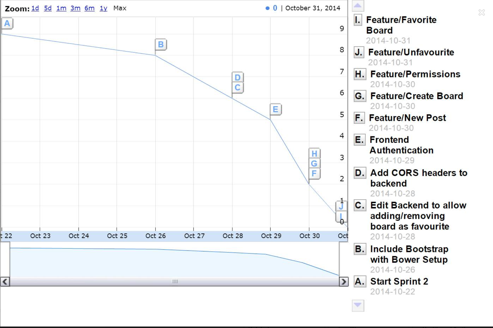
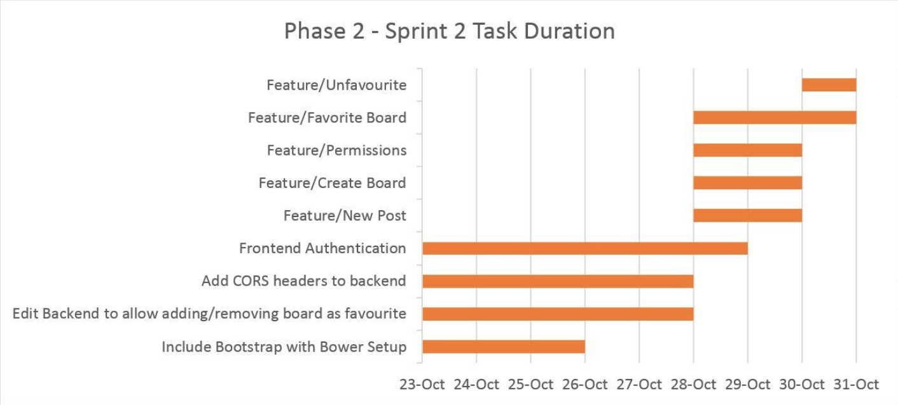

## Scrum Process Report
### Summary of Team Meetings

The meetings contain a very high-level description of what is done. All commits are linked in [Daily Scrum Highlights](#daily-scrum-highlights).

#### Meeting 1
*Friday Oct 17th, Google hangout (Sprint 1 planning)*

- **Main Discussion**: Timeline split and responsibilities delegation 
  - **Week 1**
    - Chris was put in charge of setting up a backend
    - Yuliya was supposed to come up with the UI design
    - All team members were supposed to learn Angular.js
  - **Week 2**
    - Yuliya had to create a basic frontend
    - Frontend had to be upgraded with less and bootstrap
    - Frontend should be able to work with the REST API (use Restangular)
    - Once the frontend and backend work, user stories had to be split between team members
  - **Week 3**
    - Implement user stories planned for the first release
    - Fix bugs
    - Write docs

- **Technologies to be used**:
  - **Backend**
    - [Python](https://www.python.org)
    - [MySQL](http://www.mysql.com)
    - [SQLAlchemy](http://www.sqlalchemy.org) as the Object Relational Mapper
    - [Flask](http://flask.pocoo.org)
    - [Apiary.io](http://apiary.io) to mock up the API
    - [Bower](http://bower.io) as a way to resolve dependencies
  - **Frontend**
    - HTML, CSS, JavaScript
    - [Angular.js](https://angularjs.org) as the foundation for the app
    - [Restangular](https://github.com/mgonto/restangular) to interact with REST API
    - [Bootstrap](http://getbootstrap.com) for styling
    - [Less](http://lesscss.org) to allow easy customization of Bootstrap CSS
  - **Discussion based on the choices above**
    - Each choice represents a powerful and cool way to solve a particular roadblock
    - Not all team members are familiar with the technologies chosen, so we might run to obstacles while using them
    - Since at least one team member was familiar with at least one technology picked, the choices above were approved by the team

- **Discussion**: Managing GitHub pull requests: should we delegate another team member to code review the pull request?
  - Decision: A team member creating a pull request should merge it to enforce effective time management

#### Meeting 2 
*Wednesday Oct 22th, Google hangout (Sprint 1 review, Sprint 2 planning)*

- **Sprint 1 Review**:
  - Backend is implemented
  - Basic frontend is implemented
  - Web app design is aproved by the team
  - Distirbution of responsibilities is working, the initial plan does not have to be adjusted
  - **Sprint 1 Burn Down Chart**
  
  - 

- **Sprint 2 Planning**
  - Add [Restangular](https://github.com/mgonto/restangular) to the frontend 
    - Once the frontend can communicate with the backend, schedule a meeting to distribute issues based on user stories between team members 
  - Add [Bootstrap](http://getbootstrap.com) and [Less](http://lesscss.org) to the frontend

#### Meeting 3
*Tuesday Oct 28th, in person meeting at UTM (Sprint 2 ongoing)*

- **Main Discussion**: Splitting up existing issues on the frontend
  - **Results**: The team created a diagram describing existing issues and steps to resolve each issue. Each issue was then examined closely in terms of UI to minimize potential misunderstandings. All issues were assigned.
  - 

  - | Issue and Responsibilities | Assignee |
|----------------------------|----------|
| [Backend support](https://github.com/csc301-fall2014/Proj-UTM-Team3-repo/issues/3) + [new endpoints](https://github.com/csc301-fall2014/Proj-UTM-Team3-repo/issues/14) | Chris |
| [Login screen + authentication](https://github.com/csc301-fall2014/Proj-UTM-Team3-repo/issues/11) | Yasith |
| [Add bootstrap styling to Profile](https://github.com/csc301-fall2014/Proj-UTM-Team3-repo/issues/8) | Yasith |
| [New post creation](https://github.com/csc301-fall2014/Proj-UTM-Team3-repo/issues/9) | Yuliya |
| [Favourite a board](https://github.com/csc301-fall2014/Proj-UTM-Team3-repo/issues/12) | Leo |
| [Create new board](https://github.com/csc301-fall2014/Proj-UTM-Team3-repo/issues/10) | Will |
| Documentation | Will, Yuliya |
| Charts | Leo |

- **Discussion**: Sending POST requests to the backend: how to test it
  - **Problem**: Actual backend has to be adjusted to accept external POST requests
  - **Solution**: Use mock Apiary / response status to verify POST success, so that the frontend is independent of the backend
  - **Follow-up**: Apiary demo was done to familiarize group members with it 

- **Discussion**: To create a separate favourite endpoint to retrieve data whether the user has marked the board as favourite, or retrieve this data from a more global endpoint
  - **Arguments for separate endpoint**: Time constraint. It is better to quickly create the endpoint now and update it later
  - **Arguments against it**: We should follow a cleaner approach and retrieve it from something more general, like current user endpoint as we will need it anyways 
  - **Decision**: Time constraint is a serious issue. We will create the endpoint now and update it later

#### Meeting 4
*Friday Oct 31th, in person meeting at UTM (Sprint 2 review)*

- **Sprint 2 Review**:
  - All issues based on user stories marked for first release are implemented
  - In addition, authentication support was added to the frontend
  - Extra user story (removing board from favourites) was addressed and the respective [feature](https://github.com/csc301-fall2014/Proj-UTM-Team3-repo/issues/26) was added
  - **Sprint 2 Burn Down Chart**
  
  - We noticed a bit of a drop in performance during the sprint start. However, this chart includes only major issues and does not include bugs and hotfixes, where the majority of those was happening in the beginning of this sprint, as the team was getting familiar with Angular.js.
  - 
  - **Conclusion**: Planning and splitting up responsibilities worked out well

### Daily Scrum Highlights

Due to the difficulties with scheduling, the team has chosen to use ongoing Facebook conversation as a substitute for daily Scrum meetings. The list below contains highlights from the chat from each day. 

*Oct 15, 2014*
- **Scheduling conflicts**: Discussing possible time options for a meeting
- **Chris**: Started on [database schema](../DB Schema.png) and [API documentation](http://docs.udeltio.apiary.io).

*Oct 16, 2014*
- **Yuliya**: Started working on the web app design layout

*Oct 17, 2014*
- **Yuliya**: Web app design layout is done. [Sketches](../UI_layout.pdf) with descriptions of UI elements added
- **Chris**: [Mock API](http://docs.udeltio.apiary.io/reference) is ready
- Google hangout with team members: [Sprint 1 planning](#meeting-1)
- **Discussion**: 'Mute board' and 'unsubscribe board' should be two different issues, way to resolve this on the backend. 'Subscribe to' is referred to as 'favourite' from now on 

*Oct 18, 2014*
- **Chris**: Most of the backend is done and pushed, the only thing left is OAuth/login. 
  - [Basic flask app with models for DB schema](https://github.com/csc301-fall2014/Proj-UTM-Team3-repo/commit/e4498e5d2f755969813aa9801344fcc778ee7ec7)
  - [Serializers for models](https://github.com/csc301-fall2014/Proj-UTM-Team3-repo/commit/ec6138c458d56877669d0719281fefdc46addff7)
  - [Views for API endpoints](https://github.com/csc301-fall2014/Proj-UTM-Team3-repo/commit/da863aa68658a9c9219a457eb3560f60a5f86fcd)

*Oct 19, 2014*
- **Discussion**: If a board or user is trying to be deleted and it has posts associated with it, should we remove the posts associated with it and then delete it, or should we only allow it to be deleted if there are no associated posts?
  - If the user is deleted, then the posts should be deleted as well
  - We shall not allow deleting users from the app

*Oct 20, 2014*
- Scheduled a meeting to get the release plan approved and then to have a Sprint 1 review (Google hangout is planned)
- 
*Oct 21, 2014*
- **Chris**: Added [OAuth backend implementation](https://github.com/csc301-fall2014/Proj-UTM-Team3-repo/commit/7126de3b402312d486a9a91b820d6ee89762e815)

*Oct 22, 2014*
- **Yuliya**: A basic web frontend is created and pushed
  - [Basic frontend](https://github.com/csc301-fall2014/Proj-UTM-Team3-repo/commit/00caa5148144b49549098a8b8cdd49d899a9528b) with Angular
- **Yuliya**: [UI sketches](../UI_layout.pdf) are replaced with the proper pictures instead of drafts
- Release plan is approved
- Live demo is scheduled
- Google hangout with team members: [Sprint 1 review, Sprint 2 planning](#meeting-2)
- Planning the responsibilities for the next week
  - Chris continues to work on the backend
  - Yuliya continues to work on the frontend
  - Will, Yasith, and Leo are brushing up on Angular.js
  - Yasith will be adding Restangular and Bootstrap
  - Then user stories issues will be grabbed by team members, as planned

*Oct 23, 2014*
- **Quick discussion**: Using GitHub issues. How granular do we want the issues to be? 
  - The team decided that one issue is enough per each user story feature
- **Yuliya** - Added templates to frontend with respect to UI
  - [Sidebar template](https://github.com/csc301-fall2014/Proj-UTM-Team3-repo/commit/ee1d77ab138566ac55d0377aa1b22dd6e66e2b7e)
  - [Board settings template](https://github.com/csc301-fall2014/Proj-UTM-Team3-repo/commit/552ab4f472a34840efbe0a9be6311f09467b0a65)

*Oct 24, 2014*
- **Chris**: A [README](../README.md) is created in a main directory of the project
- 

*Oct 25, 2014*
- **Yasith**: How are we managing angular dependencies? We should have bower config file in the repo, and not add the libraries manually into git. These changes will be pushed with Restangular and Bootstrap

*Oct 26, 2014*
- **Yasith**: We need to  enable CORS from the settings. Restangular in UDeltio API is hooked up, but it's disallowing cross domain requests
- **Yasith**: Added a [README](Web/README.md) to help people get setup with the environment
- **Yasith**: The [controllers are split](https://github.com/csc301-fall2014/Proj-UTM-Team3-repo/commit/bab4c869ef2eb04df0b52997eb9570dd9bde9b75) to separate files to avoid extra merges 
- **Chris**: Set up the backend to run on udeltio.com port 80. OAuth credentials are given to the team
- **Chris**: Gave Yasith access to the mock Apiary
- **Yasith**: Got bootstrap working with less, addressed issue [Add bootstrap styling to Profile](https://github.com/csc301-fall2014/Proj-UTM-Team3-repo/issues/8)(https://github.com/csc301-fall2014/Proj-UTM-Team3-repo/commit/5e3cd37e6ca2fac14cc380e1565b83ca060dd18f)
- 

*Oct 27, 2014*
- **Chris**: We need to figure out how to swap out a dependency for a version that is a fork of the program using npm
- Scheduled a meeting at Oct 28, 2014

*Oct 28, 2014*
- **Chris**: Fixed the Git tree: Because the branches depended on each other, the PRs were based off of each other.
- **Chris**: [Added Dredd](https://github.com/csc301-fall2014/Proj-UTM-Team3-repo/commit/40829fd1d1fc1f09824fa86703ee782a0e34d114) in package.json file for node
- **Issue**: The backend requires CORS headers added for local development
- Team meeting: [Sprint 2 ongoing](#meeting-3)
- **Chris**: Added [favourite endpoint to specific board](https://github.com/csc301-fall2014/Proj-UTM-Team3-repo/commit/602b9ef355b1eefa06f1a4627f4099d4f91c3cb5) is created
- **Yuliya and Yasith**: Went through each user story issue and [described steps](scrumBoard.jpg) required to implement it
- **Will and Yuliya**: Started working on documentation
- **Leo**: Started to work on setting up a VM to work with npm

*Oct 29, 2014*
- **Yasith**: We have hardcoded auth in the app now, so we can test with the real database
- **Yuliya**: Started working on creating a new Post
- **Leo**: Created a burndown charts format proposal
- **Chris and Yasith**: [CORS headers](https://github.com/csc301-fall2014/Proj-UTM-Team3-repo/issues/15) are added to the backend

*Oct 30, 2014*
- **Yuliya**: [Creating a new Post](https://github.com/csc301-fall2014/Proj-UTM-Team3-repo/issues/9) is done
  - [Basic layout](https://github.com/csc301-fall2014/Proj-UTM-Team3-repo/commit/bc48a334f6d19eb939e2e187c1e127d358a4caa0)
  - Update to new Post to [use modal pop-up](https://github.com/csc301-fall2014/Proj-UTM-Team3-repo/commit/243dbd4086b43d0f630b7a2d2d5a97a867fc87dc)
- **Yasith**: [Authentication on the frontend](https://github.com/csc301-fall2014/Proj-UTM-Team3-repo/issues/11) is done
  - [Request interceptor](https://github.com/csc301-fall2014/Proj-UTM-Team3-repo/commit/7e3e1886c6efb1049d9036c21ecef6d2db729cc7) 
  - [Retrieving OAuth token from the backend](https://github.com/csc301-fall2014/Proj-UTM-Team3-repo/commit/05dde2f6e292419102737c3c438f1a7dc73b4d0d)
  - [Adding the login form](https://github.com/csc301-fall2014/Proj-UTM-Team3-repo/commit/da28ca4caa225f13c1e8bc3ea61a4299fa329c8e)
- **Chris**: Implemented a [modal pop-up for the Board Settings](https://github.com/csc301-fall2014/Proj-UTM-Team3-repo/commit/1aa995ac7a085dfcc4be22e78533ed282bcfb658) for an existing board
- **Will**: [Creating a new Board](https://github.com/csc301-fall2014/Proj-UTM-Team3-repo/issues/10) is done
  - [CreateBoard modal](https://github.com/csc301-fall2014/Proj-UTM-Team3-repo/commit/71fc71e52f9c8fa3aed0770b1a7a06fe761f2cac)
  - [Communication with the backend](https://github.com/csc301-fall2014/Proj-UTM-Team3-repo/commit/c28ea7024f1340145295c59886f261941a1cc665)
- **Leo**: Setting up the VM is done
- **Leo**: Started working on adding a Board to favourites
- **Yuliya and Yasith**: Write-up is done and has to be put in markdown
- **Quick sync meeting**: review remaining issues and tasks

*Oct 31, 2014*
- Team meeting: [Sprint 2 review](#meeting-4)
- **Leo**: [Favourite Board](https://github.com/csc301-fall2014/Proj-UTM-Team3-repo/issues/12) functionality is implemented
  - [A button and respective communication to the backend](https://github.com/csc301-fall2014/Proj-UTM-Team3-repo/commit/95dcef6ed591629acb2b368fd9231128cc3d2a6c)
- **Chris**: [Fixed](https://github.com/csc301-fall2014/Proj-UTM-Team3-repo/commit/030ef8ee0d3e1d7cbb5a756629bf0dce6d004ebf) bug on delete Board on the backend 
- **Yuliya**: Added [unfavourite Board functionality](https://github.com/csc301-fall2014/Proj-UTM-Team3-repo/issues/26)
  - [A button and respective communication with the backend](https://github.com/csc301-fall2014/Proj-UTM-Team3-repo/commit/056a2b83bf306e234b3a780f2e80925a63f310fe)
- **Yuliya**: Code cleanup

### Issues Distribution and GitHub Issue Management System

- We had a meeting to compile all the work we need to do in order to finish the project. Then we grouped those pieces into related high level issues, and assigned issues between team members
- When we encounter bugs that should be addressed later, we create issues for those in GitHub and assign it to the responsible people

### GitHub Workflow

- We exclusively used feature/* and bug/* branches when individually working on pieces of the project
- In a branch feature/[name], name describes what the feature is very concisely, same goes for bug/[name]
- After working on a feature or a bug, we do a non fast forward merge into develop and push to origin
  - If we want to get feedback from someone, we push the branch to origin, and ask that person to give feedback
  - We restrained from using Pull Requests to ease some overhead
- We used cleanup/* branches for code cleanups

### Scrum Process

The team had to modify existing Scrum process due to the difficulties with scheduling. We decided to have two sprints, maintain ongoing chat conversation between team members to serve as a substitute for daily Scrum meetings, and have additional meetings in case of the situation that would have to be resolved quickly.

Our Scrum master was in charge of assigning basic responsibilities, but since the team members knew each other’s strengths and weaknesses, the issues were grabbed based on the skills of the individual team members, rather than assigned.

We think for our team Scrum process made a lot of sense as it enforced task completion on time, but having a Scrum master was a bit of an overkill. However, we decided to keep this role as it is useful in case team members disagree on some design decisions. 
