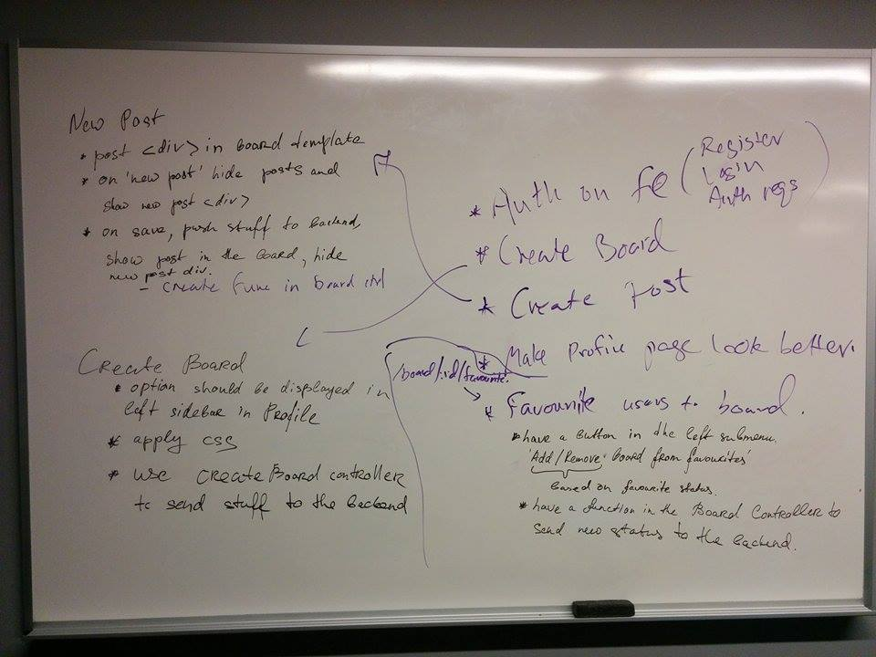
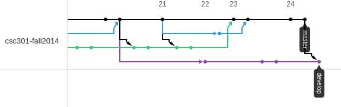
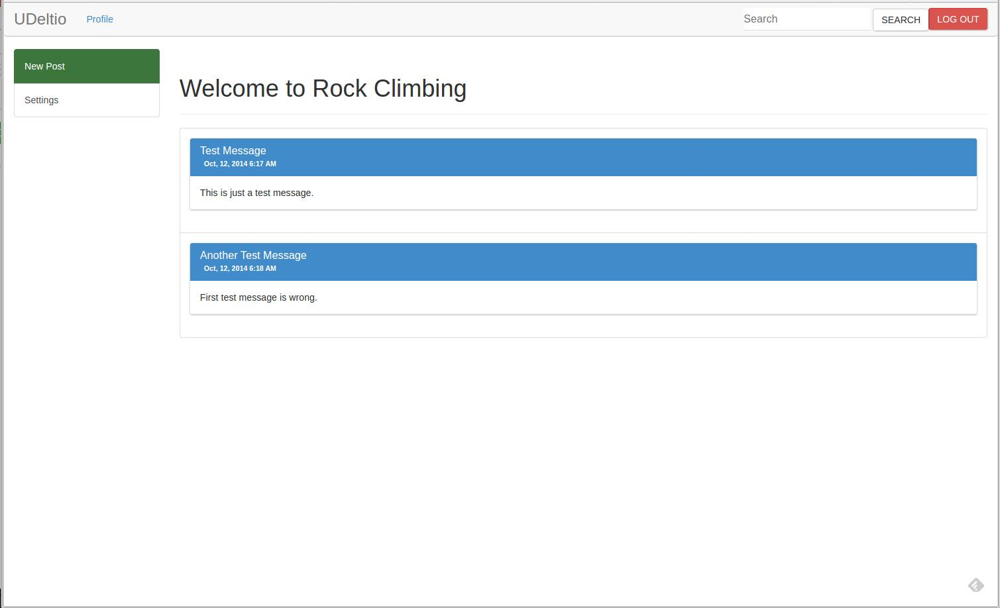

## Meeting 1
*Friday Oct 17th, Google hangout*

- **Main Discussion**: timeline split and responsibilities delegation 
  - **Week 1**
    - Chris was put in charge of setting up a backend
    - Yuliya was supposed to come up with the UI design
    - All team members were supposed to learn Angular.js
  - **Week 2**
    - Yuliya had to create a basic frontend
    - Frontend had to be upgraded with less and bootstrap
    - Frontend should be able to work with the REST API (use restangular)
    - Once the frontend and backend work, user stories had to be split between team members
  - **Week 3**
    - Implement user stories planned for the first release
    - Fix bugs
    - Write docs

- **Technologies to be used**:
  - **Backend**
    - [Python](https://www.python.org)
    - [MySQL](http://www.mysql.com)
    - [SQLAlchemy](http://www.sqlalchemy.org) as the Object Relational Mapper
    - [Flask](http://flask.pocoo.org)
    - [Apiary.io](http://apiary.io) to mock up the API
    - [Bower](http://bower.io) as a way to resolve dependencies
  - **Frontend**
    - HTML, CSS, JavaScript
    - [Angular.js](https://angularjs.org) as the foundation for the app
    - [Bootstrap](http://getbootstrap.com) for styling
    - [Less](http://lesscss.org) to allow easy customization of Bootstrap CSS

- **Discussion based on the choices above**
  - Each choice represents a powerful and cool way to solve a particular roadblock
  - Not all team members are familiar with the technologies chosen, so we might run to obstacles while using them
  - Since at least one team member was familiar with at least one technology picked, the choices above were approved by the team

- **Discussion**: managing GitHub pull requests
  - Decision: A team member creating a pull request should merge it to enforce effective time management

## Meeting 2
*Tuesday Oct 28th in person meeting at UTM*

- **Main Discussion**: splitting up existing issues on the frontend
  - **Results**: the team created a diagram describing existing issues and steps to resolve each issue. Each issue was then examined closely in terms of UI to minimize potential misunderstandings. All issues were assigned.
  - 

  - | Issue and Responsibilities | Assignee |
|----------------------------|----------|
| [Backend support](https://github.com/csc301-fall2014/Proj-UTM-Team3-repo/issues/3) + [new endpoints](https://github.com/csc301-fall2014/Proj-UTM-Team3-repo/issues/14) | Chris |
| [Login screen + authentication](https://github.com/csc301-fall2014/Proj-UTM-Team3-repo/issues/11) | Yasith |
| [Add bootstrap styling to Profile](https://github.com/csc301-fall2014/Proj-UTM-Team3-repo/issues/8) | Yasith |
| [New post creation](https://github.com/csc301-fall2014/Proj-UTM-Team3-repo/issues/9) | Yuliya |
| [Favourite a board](https://github.com/csc301-fall2014/Proj-UTM-Team3-repo/issues/12) | Leo |
| [Create new board](https://github.com/csc301-fall2014/Proj-UTM-Team3-repo/issues/10) | Will |
| Documentation | Will, Yuliya |
| Charts | Leo |

- **Discussion**: Sending POST requests to the backend: how to test it
  - **Problem**: Actual backend has to be adjusted to accept external POST requests
  - **Solution**: Use mock Apiary / response status to verify POST success, so that the frontend is independent of the backend
  - **Follow-up**: Apiary demo was done to familiarize group members with it. 

- **Discussion**: To create a separate favourite endpoint to retrieve data whether the user has marked the board as favourite, or retrieve this data from a more global endpoint
  - **Arguments for separate endpoint**: time constraint. It is better to quickly create the endpoint now and update it later.
  - **Arguments against it**: we should follow a cleaner approach and retrieve it from something more general, like current user endpoint as we will need it anyways. 
  - **Decision**: let's have this for now and adjust it later

### Daily Scrum Highlights
Due to the difficulties with scheduling, the team has chosen to use ongoing Facebook conversation as a substitute. The list below contains highlights from the chat from each day.  

*Oct 14, 2014*
- **Release plan discussion**. Created a google doc to sketch a release plan.

*Oct 15, 2014*
- **Scheduling conflicts**: discussing possible options for a meeting.
- **Chris**: Started on [database schema](../DB Schema.png) and [API documentation](http://docs.udeltio.apiary.io).

*Oct 16, 2014*
- **Yuliya**: Started working on the web app design layout

*Oct 17, 2014*
- **Yuliya**: Web app design layout is done. [Sketches](../UI_layout.pdf) with descriptions of UI elements added
- **Chris**: Mock API is ready
- Scheduled Google hangout with team members [Meeting 1](#meeting-1)
- **Discussion**: 'mute board' and 'unsubscribe board' should be two different issues, way to resolve this on the backend. 'Subscribe to' is referred to as 'favourite' from now on. 

*Oct 18, 2014*
- **Chris**: most of the backend is done and pushed, the only thing left is OAuth/login.

*Oct 19, 2014*
- **Discussion**: If a board or user is trying to be deleted and it has posts associated with it, should we remove the posts associated with it and then delete it, or should we only allow it to be deleted if there are no associated posts?
  - If the user is deleted, then the posts should be deleted as well
  - We shall not allow deleting users from the app

*Oct 20, 2014*
Scheduled a meeting to get the release plan approved (Google hangout is planned)

*Oct 22, 2014*
- **Yuliya**: a basic web frontend is created and pushed (web frontend branch)
- **Yuliya**: [UI sketches](../UI_layout.pdf) are replaced with the proper pictures instead of sketches
- Release plan is approved
- Live demo is scheduled
- Planning the responsibilities for the next week
  - Chris continues to work on the backend
  - Yuliya continues to work on the frontend
  - Will, Yasith, and Leo are brushing up on Angular.js

*Oct 23, 2014*
- **Quick discussion**: Using GitHub issues. How granular do we want the issues to be? 
  - The team decided that one issue is enough per each user story feature. 

*Oct 24, 2014*
- **Chris**: A [README](../README.md) is created in a main directory of the project.
- **Yasith**: Backend and frontend branches are merged to ease up interactions between branches.
- 
- **Yasith**: Official release notes documentation is updated: added a list of features and changes to CRC cards

*Oct 25, 2014*
- **Yasith**: How are we managing angular dependencies? We should have bower config file in the repo, and not add the libraries manually into git. These changes will be pushed with restangular and bootstrap

*Oct 26, 2014*
- **Yasith**: We need to  enable CORS from the settings. I hooked up in UDeltio API.
- **Yasith**: Added a README to help people get setup with the environment.
- **Yasith**: Added the REST endpoints
- **Yasith**: I also split up the controllers, so multiple people can work on them at the same time without getting into conflicts
- **Chris**: Set up the backend to run on udeltio.com port 80. OAuth credentials are given to the team.
- **Chris**: Gave Yasith access to the mock Apiary
- **Yasith**: Got bootstrap working with less, and the REST API seems to be working.
- 

*Oct 27, 2014*
- **Will**: merged Yasith's pull requests
- **Chris**: we need to figure out how to swap out a dependency for a version that is a fork of the program using npm
Scheduled a meeting at Oct 28, 2014

*Oct 28, 2014*
- **Chris**: Fixed the Git tree: Because the branches depended on each other, the PRs were based off of each other.
- **Chris**: Added dredd in package.json file for node
- **Issue**: The backend requires CORS headers added to it for local development
Scrum meeting
- **Chris**: /board/:id/favourite endpoint is created
- **Yuliya and Yasith**: Each user story issue now consists of steps required to implement it.
- **Will**: Added a write-up for the first scrum meeting
- **Yuliya**: Added a write-up the second for scrum meeting
- **Leo**: started to work on setting up a VM to work with npm

*Oct 29, 2014*
- **Yasith**: We have hardcoded auth in the app now, so we can test with the real database
- **Yuliya**: Started working on creating a new post
- **Leo**: Created a burndown charts format proposal
- **Chris and Yasith**: CORS headers are added to the backend

*Oct 30, 2014*
- **Yuliya**: Creating a new post is done.
- **Yasith**: Authentication is done.
- **Chris**: Started working on Board Settings
- **Will**: Started working on creating a new Board
- **Leo**: Setting up the VM is done
- **Leo**: Started working on adding a board to the list of favourites
- **Yuliya**: Created a write-up for daily Scrum meetings
Meeting is scheduled for Oct 30, 2014 for quick sync

**GitHub Issue Management System**
- We had a meeting to compile all the work we need to do in order to finish the project.
- Then we grouped those pieces into related high level issues, and assigned issues between team members.

- When we encounter bugs that should be addressed later. We create issues for those in GitHub and assign it to the responsible people.

**GitHub Workflow**
- We exclusively used feature/* and bug/* branches when individually working on pieces of the project.
- In a branch feature/[name], name describes what the feature is very concisely, same goes for bug/[name].
- After working on a feature or a bug, we do a non fast forward merge into develop and push to origin.
  - If we want to get feedback from someone, we push the branch to origin, and ask that person to give feedback.
  - We restrained from using Pull Requests to ease some overhead.

**Scrum Process**

The team had to modify existing Scrum process due to the difficulties with scheduling. We decided to have two sprints, maintain ongoing chat conversation between team members to serve as a substitute for daily Scrum meetings, and have additional meetings in case of the situation that would have to be resolved quickly.

Our Scrum master was in charge of assigning basic responsibilities, but since the team members knew each other’s strengths and weaknesses, the issues were grabbed based on the skills of the individual team members, rather than assigned.

We think for our team Scrum process made a lot of sense as it enfroced actual task completion, but having a Scrum master was a bit of an overkill. 
