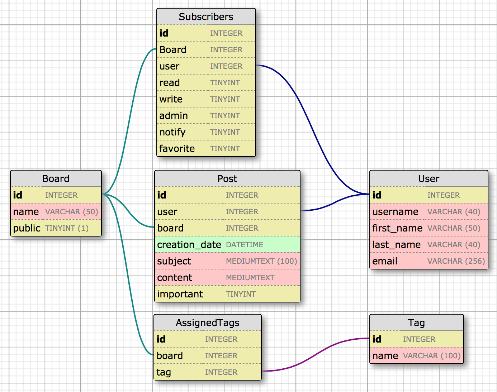

# UDeltio

Our product UDeltio is a bulletin board for University communities. Deltio stands for Bulletin in Greek.

UDeltio allows members of the community to start and join bulletin boards. Allowing them to post notices and get notifications for bulletin boards they're a member of.

For private sub-communities inside the University, you can have private boards. Where only the members can see the posted notices.

Today there exist many applications that provide similar functionality. However, while our university is using some external products to fill this niche, some students are unhappy that they must provide their personal information to a third party.

## The API

Our product uses a RESTful API written in Python using [Flask](http://flask.pocoo.org) allowing for a multitude of interactive frontends to be easily added. It also uses an OAuth like token based authentication system which allows for easy non-session based authentication. The API is documented using [API Blueprints](http://apiblueprint.org) and can be viewed through [Apiary.io](http://docs.udeltio.apiary.io)

## The Database

UDeltio uses [SQLAlchemy](http://www.sqlalchemy.org) as an [ORM](http://en.wikipedia.org/wiki/Object-relational_mapping) to interact with its database. Doing so allows the specific database to easily be changed without modification of the product. With this the specific database schema differs depending on the database that is attached, though we have described a schema using [mysql](https://www.mysql.com) types as can be seen below.

## The Web Frontend

The web frontend for UDeltio is built to work perfectly with our RESTful API. By using [Angular.js](https://angularjs.org) along with [Restangular](https://github.com/mgonto/restangular) we are able to leverage the power behind [MVC](http://en.wikipedia.org/wiki/Model–view–controller) to easily build a clean and coherent interface that is not hard tied into a model. This along with the frontend interface being completely written in Javascript allows for an offline mode to be added to it later which can be useful for mobile users.